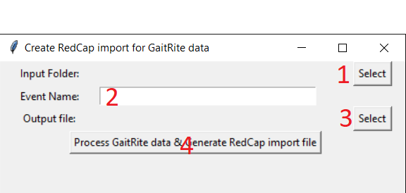

# GaitRiteCleaner

Python script for processing data exported from the GaitRite system, 
and preparing file(s) that may be imported to RedCap.

## Getting Started

It is assumed that you are running on Windows, though this script will run on other platforms.

1. Install Python for windows. Download [here](https://www.python.org/downloads/). On the first page of the installer, 
check the box labelled "Add Python to Path". 
2. Check that python is in your path. Open a DOS command window. Type "python -V", you should get back the version number:
```batch
C:\work\rivera>python -V
Python 3.10.8
```

> If the installer did *not* add python to your path, you will get output like this:

```batch
C:\work\rivera>python -V
'python' is not recognized as an internal or external command,
operable program or batch file.
```

> To fix this, follow the instructions [here](https://datatofish.com/add-python-to-windows-path/).

3. Install the packages *pandas* and *openpyxl*. Installing these packages will cause several
other packages to be installed as well. 

```batch
C:\work\rivera>python -m pip install pandas openpyxl
```

4. Now download the code. 
4.1 If you have git, you can clone the repository:
```batch
C:\work\rivera> git clone https://github.com/djsperka/GaitRiteCleaner
```
4.2 You can just download [this zip file](https://github.com/djsperka/GaitRiteCleaner/archive/refs/heads/master.zip) 
with the latest version of the code. Unzip to a local folder. 

## How to run the script
To run the script, open a Windows command prompt and navigate to the folder where
you put the source code in step 4 above. 

Run this command to start the dialog:
```batch
c:\work\rivera\GaitRiteCleaner> python grx.python
```

You should see this dialog:



1. Click *Select* to choose the input folder. This should be a folder containing
GaitRite export files (in either csv or xlsx format). Filenames should 
be in the format NNNNNN-NNN\*.csv, where *\** can be anything

